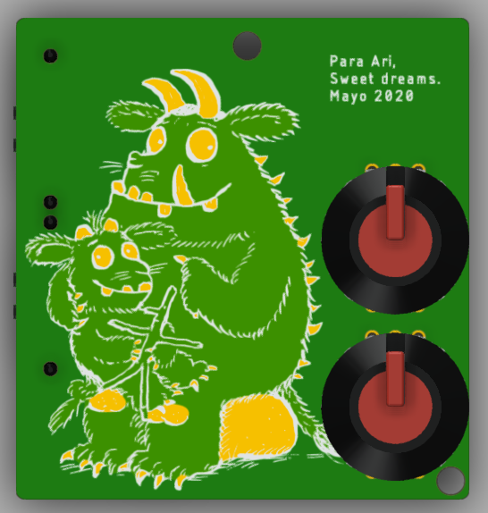
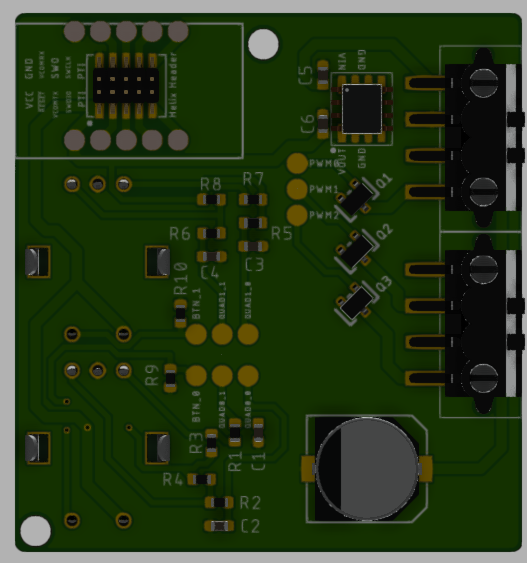
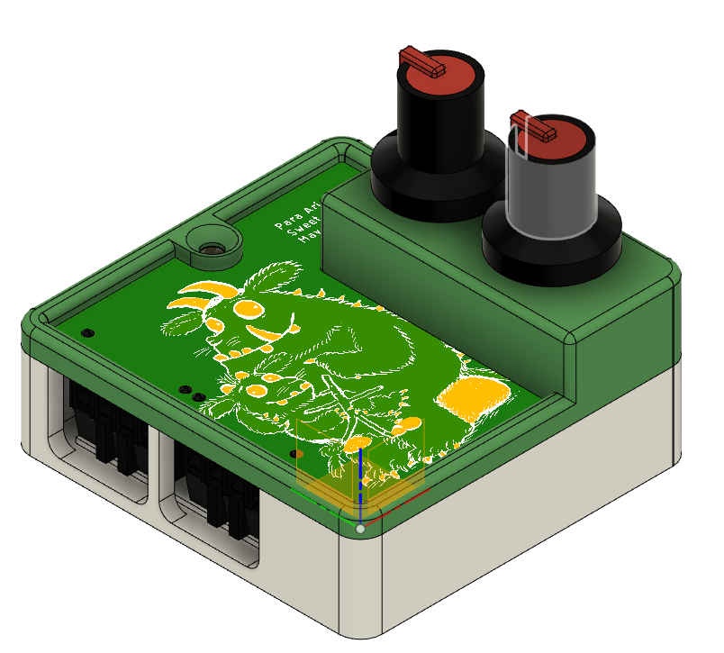

# Fairy Light Dimmer

This project started as a way to dim the LED Fairy lights in my daughter's room, as they are too bright for her to go to bed when they are on.

At the same time, I just heard about OSH's After Dark PCBs, and I wanted to do something that took advantage of them. Given my daughter's love for the Gruffalo, I decided to make the PCB visible.

The LED dimmer will be able to drive three LED strips. It contains two rotary encoders as inputs to change the individual strips' bightness, and any other stupid, overcomplicated stuff I think of.

This project consists on the PCB that drives the LEDs, an enclosure for it, and the FW for the microcontroller.

Here are some pictures of it, I hope you like it.

