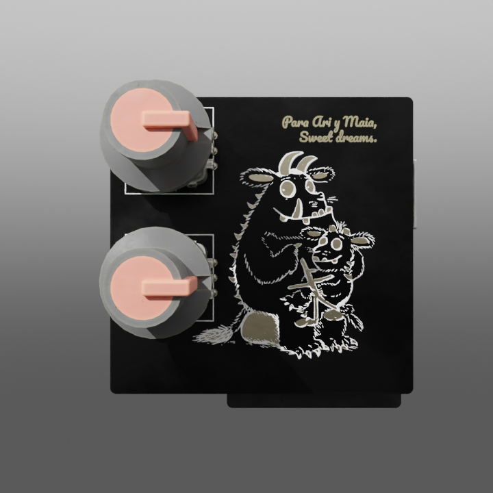
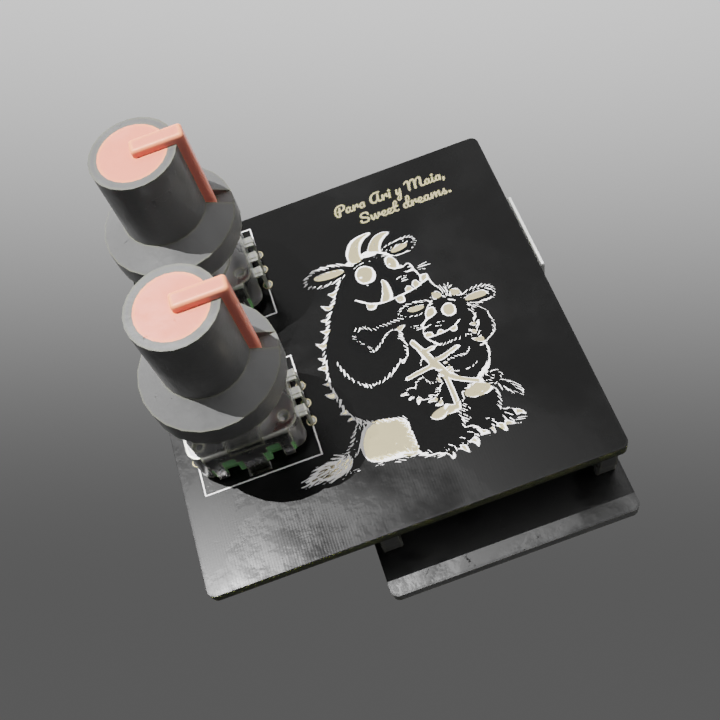
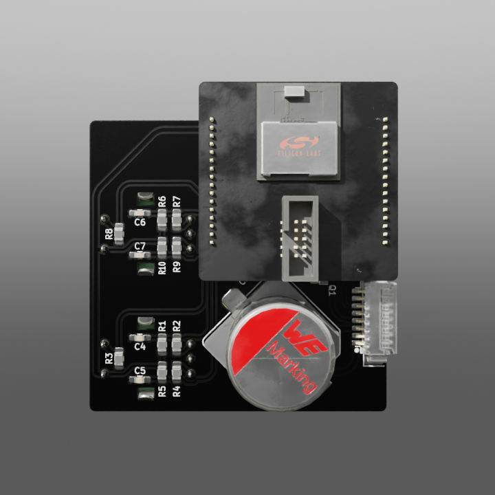
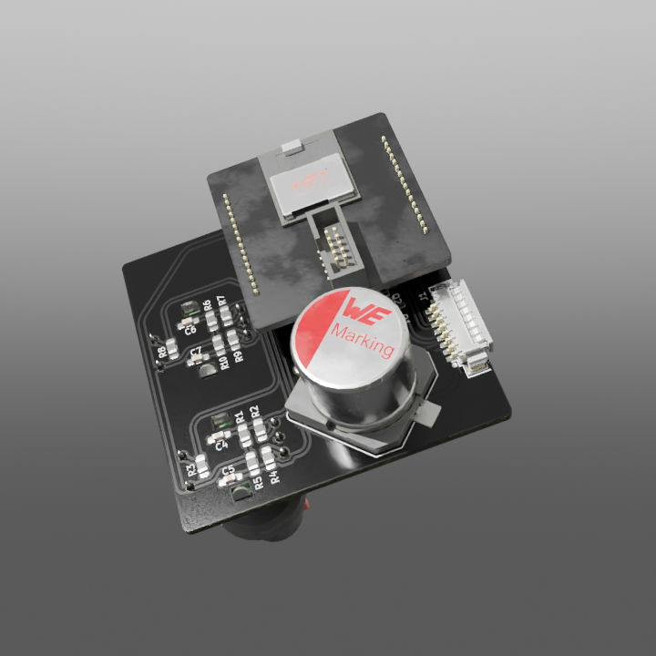

# Gruffalo Fairy Light Dimmer

A simple LED light dimmer. My kids love fairy lights, but the ones we have are too bright to use them as sleep lights so I thought about churning up a quick PWM dimmer for them.

It's a simple project with simple goals:

* Do some electronics. I won't get the Noble prize on electronics for this one.
  * Subgoal: doing something in the incredibly sexy [After Dark](https://blog.oshpark.com/2019/10/10/introducing-our-after-dark-black-fr-4-service/) finish from OSH Park.
* Play with the Silicon Labs toolchain. I don't have any FW on my Github.
* Work with encoders. They are tactile and they are nice!
* Think a bit on user interfaces that children can use.
* See how far I can get without getting sued for copyright infringement.

The design acts as a motherboard for another of my projects, a [breakout board for the BGM220P BLE Module](https://github.com/mundodisco8/BGM220P-Breakout).

This is more or less how it looks like. The renders are done with pcb2blender, and it doesn't handle transparent soldermasks yet, so it's not showing the underlying copper base.

  

  

## Tools I'm Using / Stuff I'm Stealing.

Made with:

* KiCad, obs.
* Inkscape, for the art manipulation.
* Fusion360, for 3D model generation, as a source for my Fab layers and for the enclosure.
* Blender + [pcb2blender](https://github.com/30350n/pcb2blender), to generate my renders.
* I'm using [KiBot](https://github.com/INTI-CMNB/KiBot) as the main tool in my CI/CD pipeline.

Things I definitely didn't do:

* The art, taken from [certain children's book authors](https://www.gruffalo.com/).
