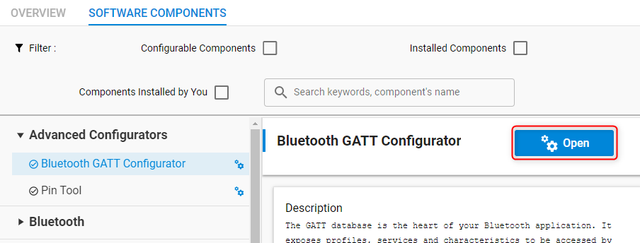
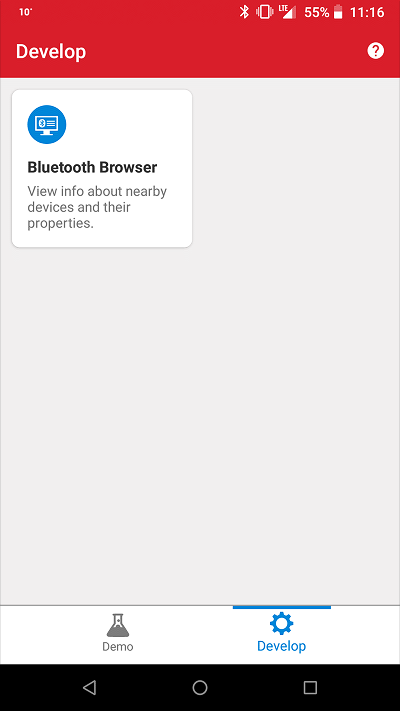
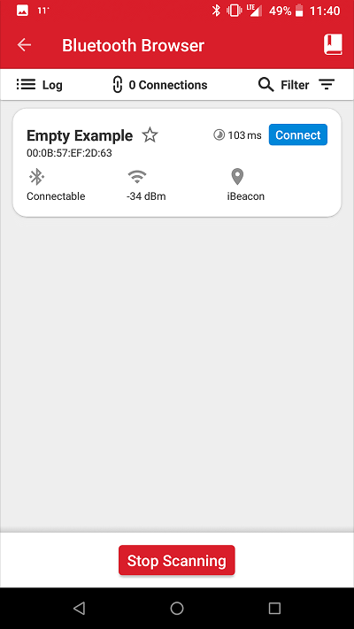
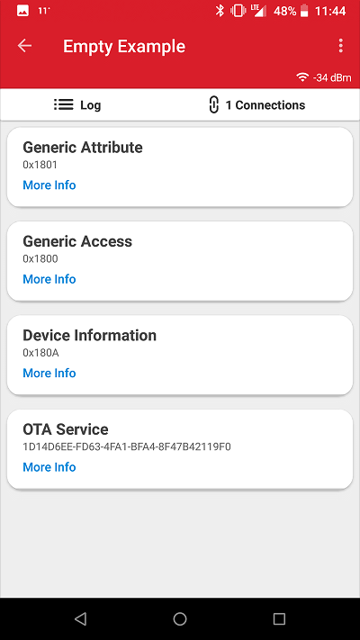

# LED Dimmer Firmware

This folder contains the Firmware project for the LED Dimmer. The project included is targeting a BGM220PWGA Module, but it could be compiled for other SoCs / Modules.

## Getting Started

The project is based on the Empty-SOC example.

It uses the 2024.6.1 SDK and GCC 12.2.1. In my experience, it's not worth to try to update the project to a newer SDK, as it always ends in tears. So one option would be to replicate the toolchain setup (specially the SDK version, the compiler is not that critical), or to get whatever is the latest and then start with a `Bluetooh SoC-Empty` project. If doing the latter, just overwrite your `app.c` with the one from the project, copy the `src` and `inc` folders (just to be specific, the `src/src` and `src/inc` folders) and make sure you add `inc` to the `include` path of the project (left click in the project, `C/C++ Build`, `Settings`, ` GNU ARM C Compiler`, `Includes`, `Include paths (-l)`).

Finally, it's a matter of preference, but I like to set all the warnings in my code, and disable all the warnings in the SDK code (as I can't do much to fix them, really). To do that, left click in the project, properties, C/C++ Build, Settings and in Tool Settings, GNU ARM C Compiler (And Assembler), remove `all warnings` and `extra warnings` and enable `Inhibit all warnings`. Then in my `inc` and `src` folders, and in `app.c`, do the same, but enable the relevant flags. **Do it in this order, or the general changes will inhibit your source code warnings**.

One of the SDK was triggering 70+ Code Analysis warnings (different than GCC warnings). To silence them, check the relevant item in Simplicity Studio settings (Window, Preferences, C/C++, Code Analysis). Double click in the warning to suppress and you can enter a pattern for filenames to be ignored. You have to do it for each static analysis warning, but there aren't that many.

### Importing the project.

The best way to import the project is

## Changes to the Empty Project

### Software Components:

#### Clock Manager

The new SDK didn't configure the clocks of my BLE module correctly and it would assert in the BT initialisation. I changed the `Clock Manager` settings, enabling the `HFXO Settings`, and leaving everything as default (XTAL Mode, 38.4MHz, 140, 50), leaving the `LFXO Settings` disabled, setting the `LFRCO Settings` to `High Precission` and finally, in `Clock Tree Settings`, picking `HXFO` as the `Default Clock Source Selection for HF clock branches` (`LFRCO` for the `LF clock branches`).

#### IO Stream: EUSART

Installed this module to get serial debugging. Set the EUART as you require, and then set the `RX` and `TX` Pins to `PB00` and `PA00` respectively.

#### Log

Used to get nice log output. Configuring it is a matter of preference, so do whatever you prefer here.

#### GPIOINT

Needed to handle the button and rotary interrupts. Doesn't neet to be configured.

#### Timer

The module is already installed, but you can set the number of software timers you need in `Bluetooth Stack Configuration` in `Bluetooth Core`.

#### Bootloader Application Interface / Bluetooth In-Place OTA

Remove them if you don't want to faf around with bootloaders. If I'm changing the software, I will need the device removed to play with it so I might as well leave it with the latest, instead of needing to do BLE updates. Maybe one day I have 20 of these around the house and it makes sense to do OTAs.

#### Rail Utility, PTI

PTI it's a radio debugging feature. I'm not going to use it, but it generates warnings if not configured. Set the `SL_RAIL_UTILITY_PTI` module to `None`.

### Pins

Use the Pin Tool to set:

* UART Logging:
  * PA00 as `EUART0_TX`.
  * PB00 as `EUART0_RX`.
* Encoder 0:
  * PA06 as `GPIO Mode` with `btn0` as `Custom Pin Name`.
  * PA07 as `GPIO Mode` with `quad0_0` as `Custom Pin Name`.
  * PA08 as `GPIO Mode` with `quad0_1` as `Custom Pin Name`.
* Encoder 1:
  * PC04 as `GPIO Mode` with `btn1` as `Custom Pin Name`.
  * PA04 as `GPIO Mode` with `quad1_0` as `Custom Pin Name`.
  * PA05 as `GPIO Mode` with `quad1_1` as `Custom Pin Name`.
* PWM:
  * PC2 as `TIMER0_CC0` with `PWM0` as `Custom Pin Name`
  * PC1
  * PC0

## Designing the GATT Database

The SOC-empty example implements a basic GATT database. GATT definitions (services/characteristics) can be extended using the GATT Configurator, which can be found under Advanced Configurators in the Software Components tab of the Project Configurator. To open the Project Configurator, open the .slcp file of the project.

To learn how to use the GATT Configurator, see [UG438: GATT Configurator User’s Guide for Bluetooth SDK v3.x](https://www.silabs.com/documents/public/user-guides/ug438-gatt-configurator-users-guide-sdk-v3x.pdf).

## Responding to Bluetooth Events

A Bluetooth application is event driven. The Bluetooth stack generates events e.g., when a remote device connects or disconnects or when it writes a characteristic in the local GATT database. The application has to handle these events in the `sl_bt_on_event()` function. The prototype of this function is implemented in *app.c*. To handle more events, the switch-case statement of this function is to be extended. For the list of Bluetooth events, see the online [Bluetooth API Reference](https://docs.silabs.com/bluetooth/latest/).

## Implementing Application Logic

Additional application logic has to be implemented in the `app_init()` and `app_process_action()` functions. Find the definitions of these functions in *app.c*. The `app_init()` function is called once when the device is booted, and `app_process_action()` is called repeatedly in a while(1) loop. For example, you can poll peripherals in this function. To save energy and to have this function called at specific intervals only, for example once every second, use the services of the [Sleeptimer](https://docs.silabs.com/gecko-platform/latest/service/api/group-sleeptimer). If you need a more sophisticated application, consider using RTOS (see [AN1260: Integrating v3.x Silicon Labs Bluetooth Applications with Real-Time Operating Systems](https://www.silabs.com/documents/public/application-notes/an1260-integrating-v3x-bluetooth-applications-with-rtos.pdf)).

## Features Already Added to the SOC-Empty Application

The SOC-Empty application is ***almost*** empty. It implements a basic application to demonstrate how to handle events, how to use the GATT database, and how to add software components.

* A simple application is implemented in the event handler function that starts advertising on boot (and on connection_closed event). This makes it possible for remote devices to find the device and connect to it.
* A simple GATT database is defined by adding Generic Access and Device Information services. This makes it possible for remote devices to read out some basic information such as the device name.
* The OTA DFU software component is added, which extends both the event handlers (see *sl_ota_dfu.c*) and the GATT database (see *ota_dfu.xml*). This makes it possible to make Over-The-Air Device-Firmware-Upgrade without any additional application code.

## Testing the SOC-Empty Application

As described above, an empty example does nothing except advertising and letting other devices connect and read its basic GATT database. To test this feature, do the following:

1. Build and flash the SoC-Empty example to your device.
2. Make sure a bootloader is installed. See the Troubleshooting section.
3. Download the **EFR Connect** smartphone app, available on [iOS](https://apps.apple.com/us/app/efr-connect/id1030932759) and [Android](https://play.google.com/store/apps/details?id=com.siliconlabs.bledemo).
4. Open the app and choose the Bluetooth Browser.
   
5. Now you should find your device advertising as "Empty Example". Tap **Connect**.
   
6. The connection is opened, and the GATT database is automatically discovered. Find the device name characteristic under Generic Access service and try to read out the device name.
   

## Troubleshooting

### Bootloader Issues

Note that Example Projects do not include a bootloader. However, Bluetooth-based Example Projects expect a bootloader to be present on the device in order to support device firmware upgrade (DFU). To get your application to work, you should either
- flash the proper bootloader or
- remove the DFU functionality from the project.

**If you do not wish to add a bootloader**, then remove the DFU functionality by uninstalling the *Bootloader Application Interface* software component -- and all of its dependants. This will automatically put your application code to the start address of the flash, which means that a bootloader is no longer needed, but also that you will not be able to upgrade your firmware.

**If you want to add a bootloader**, then either
- Create a bootloader project, build it and flash it to your device. Note that different projects expect different bootloaders:
  - for NCP and RCP projects create a *BGAPI UART DFU* type bootloader
  - for SoC projects on Series 2 devices create a *Bluetooth Apploader OTA DFU* type bootloader

- or run a precompiled Demo on your device from the Launcher view before flashing your application. Precompiled demos flash both bootloader and application images to the device. Flashing your own application image after the demo will overwrite the demo application but leave the bootloader in place.
  - For NCP and RCP projects, flash the *Bluetooth - NCP* demo.
  - For SoC projects, flash the *Bluetooth - SoC Thermometer* demo.

**Important Notes:**
- when you flash your application image to the device, use the *.hex* or *.s37* output file. Flashing *.bin* files may overwrite (erase) the bootloader.

- On Series 2 devices SoC example projects require a *Bluetooth Apploader OTA DFU* type bootloader by default. This bootloader needs a lot of flash space and does not fit into the regular bootloader area, hence the application start address must be shifted. This shift is automatically done by the *Apploader Support for Applications* software component, which is installed by default. If you want to use any other bootloader type, you should remove this software component in order to shift the application start address back to the end of the regular bootloader area. Note, that in this case you cannot do OTA DFU with Apploader, but you can still implement application-level OTA DFU by installing the *Application OTA DFU* software component instead of *In-place OTA DFU*.

For more information on bootloaders, see [UG103.6: Bootloader Fundamentals](https://www.silabs.com/documents/public/user-guides/ug103-06-fundamentals-bootloading.pdf) and [UG489: Silicon Labs Gecko Bootloader User's Guide for GSDK 4.0 and Higher](https://cn.silabs.com/documents/public/user-guides/ug489-gecko-bootloader-user-guide-gsdk-4.pdf).

### Programming the Radio Board

Before programming the radio board mounted on the mainboard, make sure the power supply switch is in the AEM position (right side) as shown below.

## Resources

[Bluetooth Documentation](https://docs.silabs.com/bluetooth/latest/)

[UG103.14: Bluetooth LE Fundamentals](https://www.silabs.com/documents/public/user-guides/ug103-14-fundamentals-ble.pdf)

[QSG169: Bluetooth SDK v3.x Quick Start Guide](https://www.silabs.com/documents/public/quick-start-guides/qsg169-bluetooth-sdk-v3x-quick-start-guide.pdf)

[UG434: Silicon Labs Bluetooth ® C Application Developer's Guide for SDK v3.x](https://www.silabs.com/documents/public/user-guides/ug434-bluetooth-c-soc-dev-guide-sdk-v3x.pdf)

[Bluetooth Training](https://www.silabs.com/support/training/bluetooth)

## Report Bugs & Get Support

You are always encouraged and welcome to report any issues you found to us via [Silicon Labs Community](https://www.silabs.com/community).